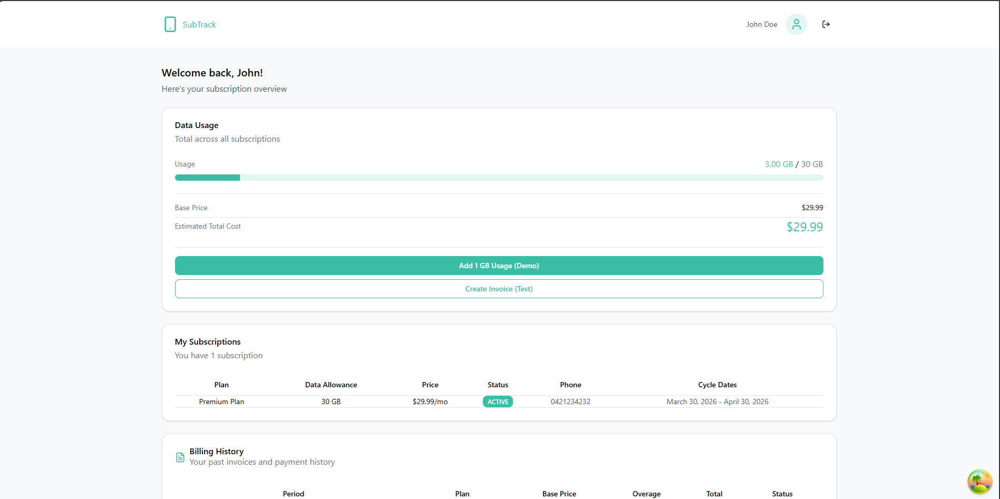
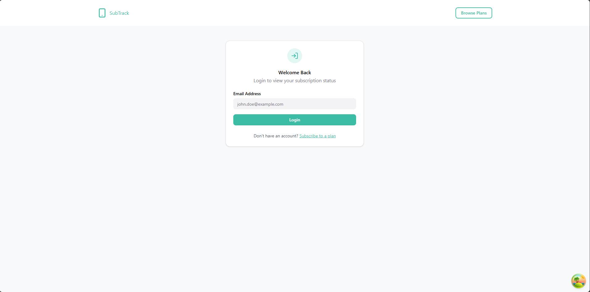
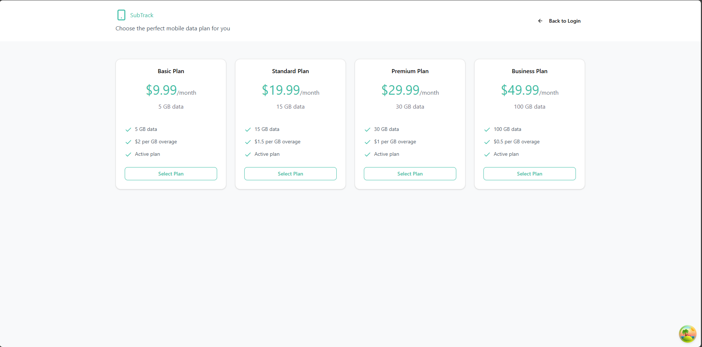

# 📌 Web Application

## 📖 Descriere

Această aplicație web permite gestionarea și organizarea datelor într-un mod eficient și intuitiv.

Utilizatorii pot vizualiza, adăuga, modifica și șterge informații printr-o interfață simplă și ușor de utilizat.

---

## 🧩 Funcționalități

- Operații CRUD (Create, Read, Update, Delete)
- Gestionare entități și relații între acestea
- Interfață pentru utilizatori
- Secțiune de administrare
- Validări și logică de business
- API pentru accesarea datelor

---

## 🖼️ Interfață aplicație

### Pagina principală

### Login

### Planuri

---

## 🏗️ Arhitectură

Aplicația este construită pe mai multe niveluri:

- Presentation Layer (MVC / API) – interfața utilizator
- Business Layer (Services) – logica aplicației
- Data Access Layer (ORM) – acces la date
- Database (SQL Server) – stocare

---

## ⚙️ Tehnologii utilizate

- Spring Boot
- PostgreSQL
- REST API
- Dependency Injection
- Cache
- Logging

---

